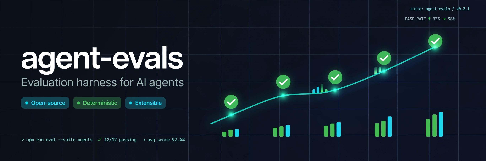

# agent-evals

[](https://github.com/SachuJames/agent-evals/actions/workflows/ci.yml)
[](https://www.python.org/)
[](LICENSE)



An evaluation harness for AI agents. Define tasks in YAML, run them against
pluggable agent runners, score the answers, capture full step-by-step traces,
and track regressions run over run.

## Quickstart

```bash
pip install -e .
agent-evals run --suite builtin --runner mock
```

```
Running 10 tasks with runner 'mock'...
run id: 9f3c1a2b4d5e
  [PASS] chained_calc                score=1.00 steps=3
  ...
Result: 10/10 passed, avg score 1.00
```

Compare two runs and generate a report:

```bash
agent-evals run --suite builtin --runner mock --mock-mode flaky
agent-evals diff <run-a> <run-b>
agent-evals report <run-b> -o report.html --vs <run-a>
```

Or run the full demo: `bash demo.sh`

## How it works

**Tasks** are YAML files: a prompt, whitelisted tools, and scoring checks.
Ten built-in tasks ship with the harness, across math reasoning, JSON
extraction, multi-step tool use, instruction following, and logic puzzles.

```yaml
id: chained_calc
name: Chained calculation
category: tool_use
prompt: |
  A store sells notebooks for $4.50 each. A customer buys 6 notebooks and a 10%
  discount is applied to the total. What does the customer pay?
  Respond with only the number, rounded to 2 decimals.
tools: [calculator]
max_steps: 8
scoring:
  - type: exact_match
    expected: "24.30"
```

**Runners** decide the agent's next action. Two ship out of the box:

| Runner | Use |
|---|---|
| `mock` | Deterministic scripted agent, for CI and offline runs. `--mock-mode flaky` fails two tasks on purpose, for diff demos. |
| `http` | Any OpenAI chat-completions compatible endpoint. Set `AGENT_EVALS_BASE_URL` (plus `AGENT_EVALS_API_KEY`, `AGENT_EVALS_MODEL`). |

**Tool loop.** The harness drives the agent loop and executes whitelisted
tools: `calculator` (sandboxed arithmetic), `kv_store` (per-run key-value
state), `web_fetch` (per-task stubbed responses, so evals stay offline).

**Scorers.** `exact_match`, `contains`, `regex`, `json_schema`, `llm_judge`
(with a deterministic `StubJudge` for offline use), and `python` for custom
`module:function` scorers. Checks are weighted and averaged per task.

**Traces and history.** Every step of every task is persisted to SQLite
(`.agent-evals/runs.db` by default), exportable as JSONL. The CLI lists runs,
shows per-task scores and full traces, diffs two runs (improved / regressed /
unchanged with score deltas), and renders a single-file offline HTML report.

## CLI reference

```
agent-evals run --suite builtin --runner mock [--mock-mode flaky] [--report out.html]
agent-evals list-tasks
agent-evals runs
agent-evals show <run-id> [--trace <task-id>] [--jsonl trace.jsonl]
agent-evals diff <run-a> <run-b>
agent-evals report <run-id> -o report.html [--vs <other-run-id>]
```

## Project layout

```
agent_evals/
  tasks.py          YAML task loading and validation
  builtin_tasks/    10 shipped eval tasks
  runners.py        MockRunner, HttpRunner (OpenAI-compatible)
  tools.py          calculator, kv_store, web_fetch
  loop.py           agent tool-use loop
  scorers.py        exact_match, contains, regex, json_schema, llm_judge, python
  store.py          SQLite run history, traces, regression diffs
  report.py         single-file HTML report
  cli.py            command line interface
tests/              58 pytest tests
demo.sh             end-to-end demo: run, diff, report
```

## Development

```bash
python -m venv .venv && source .venv/bin/activate
pip install -e ".[dev]"
pytest -q && ruff check . && ruff format --check . && mypy agent_evals
```

## License

MIT. See [LICENSE](LICENSE).
